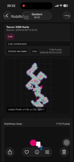

# Tesvor X500 ESPHome Vacuum

Lokale ESPHome-/MQTT-Integration für einen Tesvor X500/X500 Pro Saugroboter auf Basis des originalen ESP8266/ESP-12S WLAN-Moduls.

Das Projekt ersetzt die Cloud-Anbindung durch lokale UART-Kommandos, Home-Assistant-Entitäten und eine einfache Kartenvisualisierung auf Basis der vom Roboter gelieferten Pfadpunkte.

## Status

| Bereich | Stand |
|---|---|
| ESPHome Flash auf ESP-12S | funktioniert |
| Smart / Spot / Edge / Stop / Laden | funktioniert |
| Richtungsbefehle | funktioniert |
| Zickzack / Wischen | funktioniert als `0x22 04`, Status `0x0B` |
| Wischintensität | Low/High per UART bestätigt; Default/Off nach Muster vorhanden |
| Karte / Pfadpunkte | funktioniert über MQTT + `current.json` |
| Archiv | funktioniert beim Rückkehrstatus `charging`/`docked` |
| Reinigungsdauer | ESP-seitig gezählt |
| Mop Cleaning | experimentell; ACK ja, aber nicht als zuverlässiger Startmodus bestätigt |
| Saugstärke / Fan | experimentell; Original-Kommandos bekannt, Status-Rückmeldung nicht zuverlässig |

## Hardware

Getestet mit:

- Tesvor X500/X500 Pro
- Ai-Thinker ESP-12S / ESP8266EX WLAN-Modul
- 4 MB Flash
- UART 115200 Baud
- ESPHome 2025.7.x

Flash-/UART-Pins am J1-Stecker:

| J1 Leitung | Funktion |
|---|---|
| Rot | 3.3V |
| Schwarz | GND |
| Grün/Gelb | UART RX/TX, je nach Adapter ggf. tauschen |

Wichtig: niemals 5V auf das ESP-Modul geben.

## Repository-Struktur

```text
.
├── x500.yaml                  # ESPHome Firmware für den Roboter
├── secrets.yaml.example       # Beispiel-Secrets für ESPHome
├── tesvor_map_writer.py       # MQTT → current.json/archive writer
├── web/map.html               # Kartenanzeige mit Archivauswahl
├── scripts/start_writer.sh    # Synology/DSM Startscript Writer
├── scripts/start_http.sh      # einfacher HTTP-Server für Karte
├── examples/home-assistant/   # Lovelace/iframe Beispiele
└── docs/                      # Protokoll, Installation, Erkenntnisse
```

## Schnellstart ESPHome

```bash
cp secrets.yaml.example secrets.yaml
# secrets.yaml anpassen
esphome compile x500.yaml
esphome upload x500.yaml --device <IP oder COM-Port>
```

OTA-Beispiel:

```powershell
python -m esphome upload x500.yaml --device 192.168.178.108
```

## MQTT Topics

Der ESP veröffentlicht zusätzliche Rohdaten:

```text
tesvor/x500/state
tesvor/x500/map/points
```

`tesvor/x500/map/points` enthält Punkt-Batches:

```json
{"p":[[seq,x,y,type],[seq,x,y,type]]}
```

Der Writer baut daraus:

```text
current.json
archive_index.json
archive/*.json
```

## Map Writer

Abhängigkeit:

```bash
pip3 install -r requirements.txt
```

Start:

```bash
export TESVOR_MQTT_HOST=192.xxx.xxx.xx
export TESVOR_MQTT_USER='DEIN_USER'
export TESVOR_MQTT_PASSWORD='DEIN_PASSWORT'
python3 tesvor_map_writer.py
```

Standardpfad auf Synology:

```text
/volume2/docker/tesvor-map
```

Der Pfad kann per Environment Variable geändert werden:

```bash
export TESVOR_MAP_DIR=/volume2/docker/tesvor-map
```

## Karte anzeigen

Variante mit einfachem HTTP-Server:

```bash
cd /volume2/docker/tesvor-map
python3 -m http.server 8095
```

Dann:

```text
http://192.xxx.xxx.xx:xxxx/map.html
```

Für Home Assistant Mobile App ist besser, die Karte unter `/config/www/tesvor-map` bereitzustellen und im iframe relativ einzubinden:

```yaml
type: iframe
url: /local/tesvor-map/map.html
aspect_ratio: 100%
```
---

## Screenshots

### Reverse engineering environment


### vertical-stack-card tesvor


### ifram-card tesvor live mapr



---
## Sicherheit

Keine Secrets ins Repository committen. `x500.yaml` verwendet `!secret`; echte WLAN-, MQTT-, OTA- und API-Schlüssel gehören nur in `secrets.yaml`.

## Haftung

Reverse Engineering / Firmware-Flashing auf eigene Gefahr. Vor jedem Flashen ein vollständiges 4-MB-Backup der Original-Firmware erstellen.
